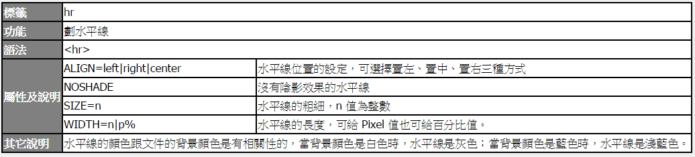
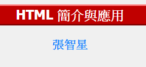

Title: Texts 文字
Date: 2017-09-23 21:32
Category: HTML
Tags: HTML , Texts
Slug: Texts
Author: 40423222

介紹關於文字的指令

<!-- PELICAN_END_SUMMARY -->
<!-- 從2017springcd_hw複製過來 -->

## 小工具:
<table align=center border=1 cellspacing=0 style="border:1px solid black" bgcolor=white>
<tr><th class=boldw>標籤<th class=boldw>說明及範例
<tr><td>&lt;B&gt;<td>將所標記的文字<b>字型加粗
<tr><td>&lt;I&gt;<td>將所標記的文字<i>變成斜體
<tr><td>&lt;U&gt;<td>將所標記的文字<u>加上底線</u>
<tr><td>&lt;STRIKE&gt;<td>將所標記的文字<strike>畫線刪除</strike>
<tr><td>&lt;BIG&gt;<td>將所標記的文字<big>放大</big>
<tr><td>&lt;SMALL&gt;<td>將所標記的文字<small>縮小</small>
<tr><td>&lt;SUP&gt;<td>將所標記的文字變成上標
<tr><td>&lt;SUB&gt;<td>將所標記的文字變成下標
<tr><td>&lt;EM&gt;<td>將所標記的文字<em>加以強調</em>
<tr><td>&lt;STRONG&gt;<td>將所標記的文字<strong>加重語氣</strong>
<tr><td>&lt;TT&gt;<td>將所標記的文字以 <tt> Teletype font </tt>字型表現，常用在固定大小的文字上
<tr><td>&lt;CODE&gt;<td>將所標記的文字以 <code> Code Fragment </tt>字型表現，常用在程式碼的敘述上
<tr><td>&lt;VAR&gt;<td>將所標記的文字以 <var> Variable </var>字型表現，常用在算數式的變數上
</table>

### 指令:
<pre class="brush: python">
<table align=center border=1 cellspacing=0 style="border:1px solid black" bgcolor=white>
<tr><th class=boldw>標籤<th class=boldw>說明及範例
<tr><td>&lt;B&gt;<td>將所標記的文字<b>字型加粗
<tr><td>&lt;I&gt;<td>將所標記的文字<i>變成斜體
<tr><td>&lt;U&gt;<td>將所標記的文字<u>加上底線</u>
<tr><td>&lt;STRIKE&gt;<td>將所標記的文字<strike>畫線刪除</strike>
<tr><td>&lt;BIG&gt;<td>將所標記的文字<big>放大</big>
<tr><td>&lt;SMALL&gt;<td>將所標記的文字<small>縮小</small>
<tr><td>&lt;SUP&gt;<td>將所標記的文字變成上標
<tr><td>&lt;SUB&gt;<td>將所標記的文字變成下標
<tr><td>&lt;EM&gt;<td>將所標記的文字<em>加以強調</em>
<tr><td>&lt;STRONG&gt;<td>將所標記的文字<strong>加重語氣</strong>
<tr><td>&lt;TT&gt;<td>將所標記的文字以 <tt> Teletype font </tt>字型表現，常用在固定大小的文字上
<tr><td>&lt;CODE&gt;<td>將所標記的文字以 <code> Code Fragment </tt>字型表現，常用在程式碼的敘述上
<tr><td>&lt;VAR&gt;<td>將所標記的文字以 <var> Variable </var>字型表現，常用在算數式的變數上
</table>
</pre>

## 換行指令:

### 列如:
<html>
<body>
利用&lt;br&gt;來切換 到下一行

新的一個段落，會和前面的文字隔開一列
換行並加上水平線
<blockquote>文字會自成一個段落，並以縮排的方式表現出來，而且與上下文章保留一段空白</blockquote>
靠右視窗寬度50%無陰影粗10:

以上為換行指令範例
</body>
</html>

### 指令:
<pre class="brush: python">
<html>
<body>
利用＆lt;br＆gt;來切換 到下一行

新的一個段落，會和前面的文字隔開一列
換行並加上水平線
<blockquote>文字會自成一個段落，並以縮排的方式表現出來，而且與上下文章保留一段空白</blockquote>
靠右視窗寬度50%無陰影粗10:

以上為換行指令範例
</body>
</html>
</pre>
為了不讓「小於」及「大於」符號被瀏覽器解譯，因此要寫成「＆lt;」和「＆gt;」。相關的對照表，會在後續章節說明。

## 字體大小和位置:

### 列如:
<h1 align="left">H1在左邊</h1>

<h6 align="right">H6在右邊</h6>

<h3 align="center">範圍:H1到H6,H1為最大,H6為最小</h3>

字體大小為1

字體大小為7

可輸入比7大的值,但最大的顯示只會到7

可輸入負數來縮小字體大小

FACE="Symbol" 你便可以顯示羅馬字母 a, b, c, d

用 FACE="標楷體" 來顯示 中文標楷體

字的顏色

### 指令:
<pre class="brush: python">
<h1 align="left">H1在左邊</h1>

<h6 align="right">H6在右邊</h6>

<h3 align="center">範圍:H1到H6,H1為最大,H6為最小</h3>

字體大小為1

字體大小為7

可輸入比7大的值,但最大的顯示只會到7

可輸入負數來縮小字體大小

FACE="Symbol" 你便可以顯示羅馬字母 a, b, c, d

用 FACE="標楷體" 來顯示 中文標楷體

字的顏色
</pre>

### 說明hn:
<table border="10" width="100%" align="center">
<tr>
<td  style="text-align:center" bgcolor='#FFD78C'>標籤</td><td style="text-align:center" bgcolor='#FFD78C'>語法</td><td style="text-align:center" bgcolor='#FFD78C'>屬性</td>
<tr>
<td style="text-align:center">hn, n=1, 2, 3, 4, 5, 6<td style="text-align:center">&lt;hn&gt;要顯示的內容&lt;/hn&gt;<td style="text-align:center">ALIGN = left|right|center
</table>

### 指令:
<pre class="brush: python">
<table border="10" width="100%" align="center">
<tr>
<td  style="text-align:center" bgcolor='#FFD78C'>標籤</td><td style="text-align:center" bgcolor='#FFD78C'>語法</td><td style="text-align:center" bgcolor='#FFD78C'>屬性</td>
<tr>
<td style="text-align:center">hn, n=1, 2, 3, 4, 5, 6<td style="text-align:center">&lt;hn&gt;要顯示的內容&lt;/hn&gt;<td style="text-align:center">ALIGN = left|right|center
</table>
</pre>

### 表格說明FONT:
<table border="10" width="100%" align="center">
<tr>
<td  style="text-align:center" bgcolor='#FFD78C'>標籤</td><td style="text-align:center" bgcolor='#FFD78C'>語法</td><td style="text-align:center" bgcolor='#FFD78C'>屬性</td>
<tr>
<td style="text-align:center">FONT<td style="text-align:center">&lt;FONT&gt;要顯示的內容&lt;/FONT&gt;<td style="text-align:center">SIZE=string, COLOR=#RRGGBB, FACE=font names
</table>

### 指令:
<pre class="brush: python">
<table border="10" width="100%" align="center">
<tr>
<td  style="text-align:center" bgcolor='#FFD78C'>標籤</td><td style="text-align:center" bgcolor='#FFD78C'>語法</td><td style="text-align:center" bgcolor='#FFD78C'>屬性</td>
<tr>
<td style="text-align:center">FONT<td style="text-align:center">&lt;FONT&gt;要顯示的內容&lt;/FONT&gt;<td style="text-align:center">SIZE=string, COLOR=#RRGGBB, FACE=font names
</table>
</pre>

<table align=center border=1 cellspacing=0 style="border:1px solid black" bgcolor=white>
<tr><td class=boldw>講解<td colspan=2>&lt;pre&gt; (Preformatted Text) 所標記起來的是預先已排版過的文章，使其以原貌表現在網頁上。雖然 &ltpre&gt; 可以將所標記的文字以原貌呈現出來，但文章中如果有 HTML 的標籤，瀏覽器仍會對其進行處理後，才會呈現出來。但如果我們只是要顯示標籤但不想要處理顯現標籤時，就可以改用 &ltXMP&gt; 標籤，此標籤會將所有其它的 HTML 標籤原封不動地呈現出來
</table>

### 參考網站
texts: 
<a href="https://mirlab.org/jang/books/html/">https://mirlab.org/jang/books/html/</a> 
參考對象:
