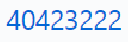

Title: ShowImg 顯示圖片
Date: 2017-11-02 20:42
Category: HTML
Tags: HTML
Slug: ShowImg
Author: 40423222

以下為HTML的Show img說明

<!-- PELICAN_END_SUMMARY -->
<!-- 如何放圖片上Blog -->

## <b>貼上圖片:</b>

  
  

### 指令:
<pre>
<xmp></xmp>
</pre>

### 外加功能:
注意: 有些功能可以不使用

<table border="5" width="65%" align="left">
<tr>
<td  style="text-align:center" bgcolor='#FFD78C'>屬性</td>
<td style="text-align:center" bgcolor='#FFD78C'>說明</td>
<tr>
<td style="text-align:center">align</td>
<td style="text-align:center">圖案的位置(left,center,right,absmiddle)</td>
<tr>
<td style="text-align:center">alt</td>
<td style="text-align:center">圖片的註解</td>
<tr>
<td style="text-align:center">border</td>
<td style="text-align:center">邊框大小</td>
<tr>
<td style="text-align:center">src</td>
<td style="text-align:center">要顯示的圖片</td>
<tr>
<td style="text-align:center">width</td>
<td style="text-align:center">圖片的寬度</td>
<tr>	
<td style="text-align:center">height</td>
<td style="text-align:center">圖片的高度</td>
<tr>	
<td style="text-align:center">hspace</td>
<td style="text-align:center">圖片的左右邊界</td>
<tr>	
<td style="text-align:center">vspace</td>
<td style="text-align:center">圖片的上下邊界</td>
</table>